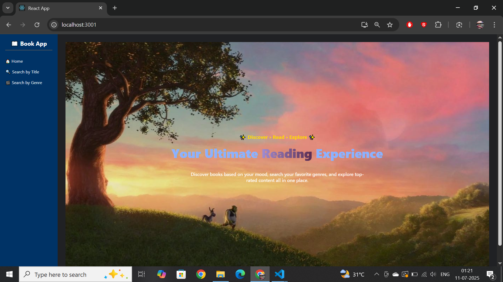
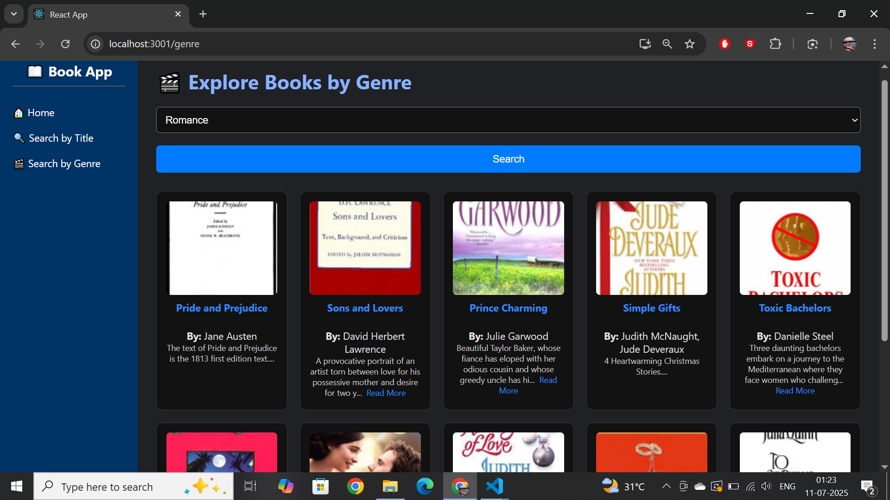
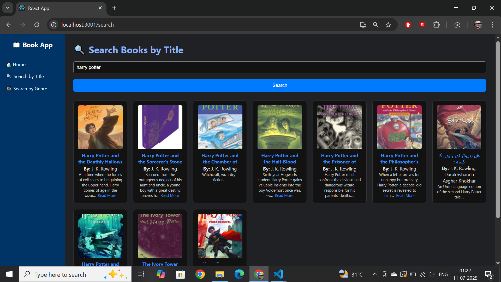

# 📚 Book Explorer

Your ultimate reading experience.

Explore books based on your favorite genres or search by title using our Flask + React-powered app.

---

## 🌟 Features

- 🔍 Search books by **title**
- 🎬 Discover books by **genre**
- 🖼️ Book covers, author info, and descriptions
- 📖 "Read more" toggle for long descriptions
- 📱 Responsive design using modern CSS
- 🧭 Sidebar navigation with **Home**, **Genre Search**, and **Title Search**
- 🚀 Pagination for 20 books per page

---

## 🖼️ Preview

### 🏠 Home Page  


### 🎬 Genre Search  


### 🔍 Title Search  


---

## 🛠 Tech Stack

- **Frontend:** React (with Axios)
- **Backend:** Flask + Google Books API
- **Styling:** Custom CSS with modern design

---

## 🧪 How to Run

```bash
# Backend (Flask)
cd bookrec
python app.py

# Frontend (React)
cd book-ui
npm install
npm start
